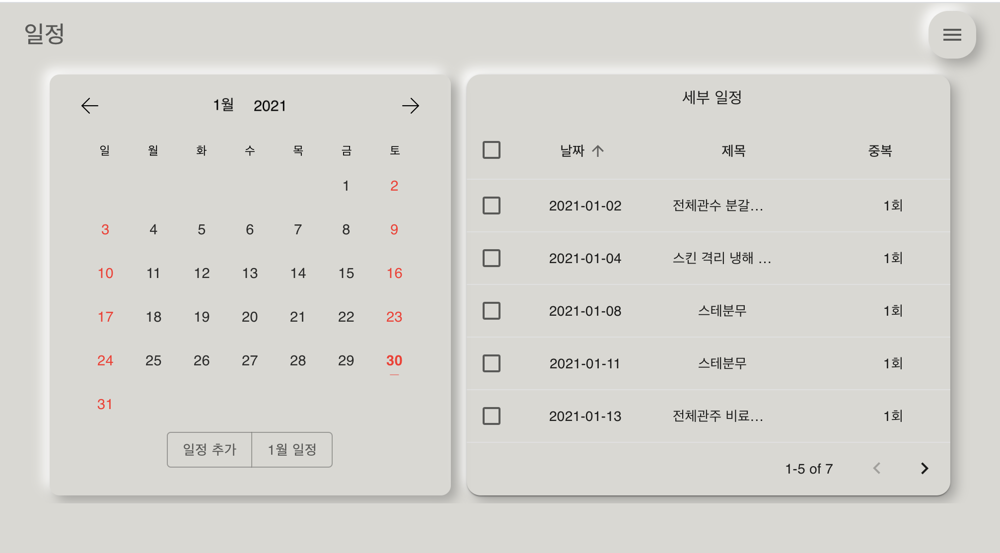

# plantpoint_frontend

Frontend for SmartFarm System . Should activate with plantpoint_backend.


### Demo

This is [Video](https://www.youtube.com/watch?v=Ues5e7m1w10&lc=UgyAODgET9TnCkozM9J4AaABAg). For short explanation, Infinite Icon on switch controller component is for **setting automations**. Plus, The environments history which is on the bottom of the page could show you the data for **today**. CCTV component is a photo in this demo. Please, revise src in this image tag from the CCTV/index.js file.


### Installation

To install related packages, write a command line below on the project home directory.

```bash
npm install
```


### Prerequisite

Before start this frontend project, set these constants in plantpoint-frontend/src/reference/secret.ts

```typescript
/* plantpoint-frontend/src/reference/secret.ts */
export const API = 'http://IP:PORT'; // Backend Server ip and port
export const WS = 'http://IP:PORT'; // Websocket ip and port
export const CAM_IP = 'http://IP:PORT' // CCTV Web Camera ip and port
```


## Usage

<p align="center">
  
</p>


<br/>

* Power Automation
* Remote Control
* Environments and Power Logging
* CCTV

<br/>

<p align="center">
  
</p>


<br/>

* Add Schedule 
* Change Schedule
* Find Schedule
* Remove Schedule